## Host 

Vivian Shangxuan Zhang

* Co-founder & CTO of SupStat(数博思达) Inc.

* Founder, Lead Instructor of NYC Data Science Academy

* Founder, NYC Open Data Meetup

* Adjunct Professor at NYU and Stony Brook University  
   

   

---

## 課程大綱

* 國際Open Data開放現況與應用案例
* R basic
  * ETL, crawling web, R plot, R shiny web app (Rmarkdown, knitr, slidify)
* 資料探勘競賽

  

---

## 學員們

| 公司          |            |
|:-------------:|:-------------:|
|極圖航天科技 | 航運定位技術|
|三商行 |               |
|和泰汽車 | |
|天氣風險 | |
|精誠隨 | |
|清水傳股份有限公司 | 台客帶路app|
|生活工場 | 育冠企業|
|景翊科 | i68國道資訊|
|博連資訊 | 物流管理系統|
|國眾電腦 | |
|綠光能數位 | 網站開發|
|聯經數位 | udn|
|鴻海 | BI工具部門|

---

## R can connect to the world

* 網頁爬蟲
  * library(RCurl), library(XML) - htmlParse(), readHTMLTable()
  * library(RSelenium)
* library(RJSONIO), library(XLConnect)
* 相容統計軟體
  * read.dta(), read.spss(), read.xport()
* 各種資料庫
  * RODBC - Connect to SQL, MySQL, Impala, Hive or others
* 連結其他語言
  * shell.exec(), library(rpy2), library(WriteXLS), library(rJava), Tableau
* 視覺化套件
  * graphics, ggplot2, lattice, maptools, recharts

---

## ggplot2的多維度圖表

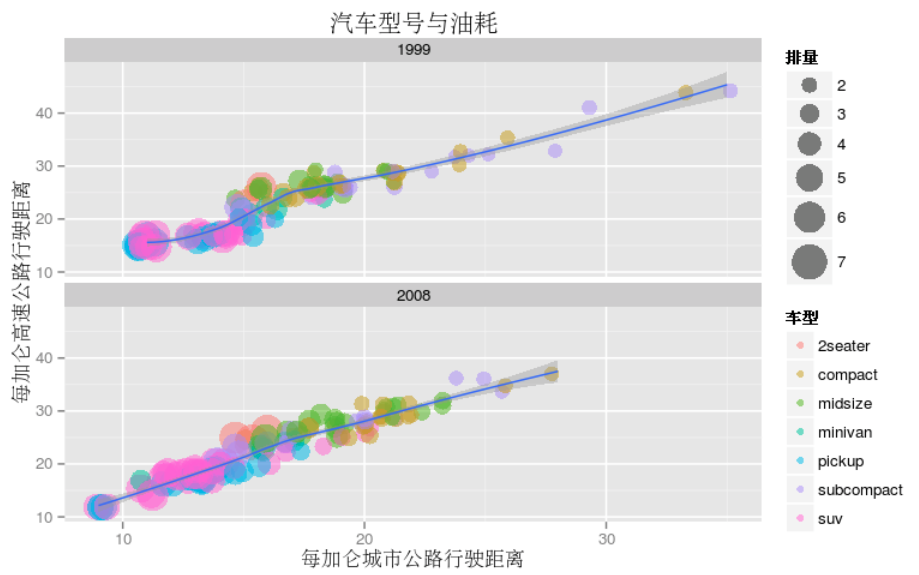

---

## ptt 網路爬蟲

* Wanted板推文文化網路分析
  * 每個圈圈代表一個網友，圈圈越大代表越多不同人推文(通常是女生)   [Link](http://bryannotes.blogspot.tw/2014/08/r-ptt-wantedsocial-network-analysis.html)

--- 

## 大大降臨

* Joel Gurin
  * Author of Open Data Now
  * Senior Advisor at The GovLab

 
 

---

## Open Data 500 Companies Project 

 

---

---

## Filter what you like

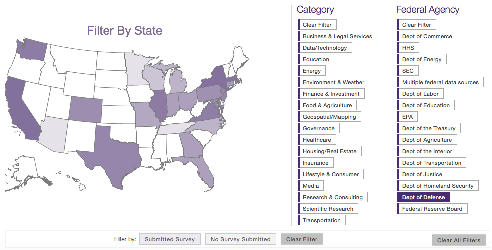

---

<iframe src="http://www.opendata500.com/chart/" width="768" height="688" marginwidth="0" marginheight="0" scrolling="yes" frameborder="0"></iframe>

---

## US Government Open Data - Data.gov

* Over 137,601 datasets in the world in more than 20 catagory
* api, sample code, help to conduct research, build apps, design data visualizations, and more.
  * Open tool: Spatial Search, CSV-to-API, DB-to-API, PDF-Filler ... 

 

---

## 強調 `資料的產值`

---

## 當然不只是做研究

---

## 也不是辦徵文比賽   **Challenge.gov**

 

---

 
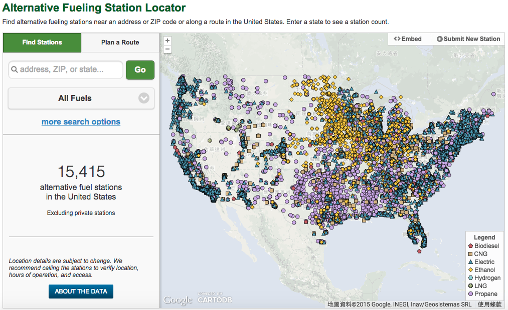

---

 

---

## CrunchBase

* Database of start-ups which operates by TechCrunch
* Coordination mechanism & LinkedIn API
* Spotlight Program 
* LinkedIn API  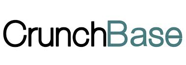

---

## Slack

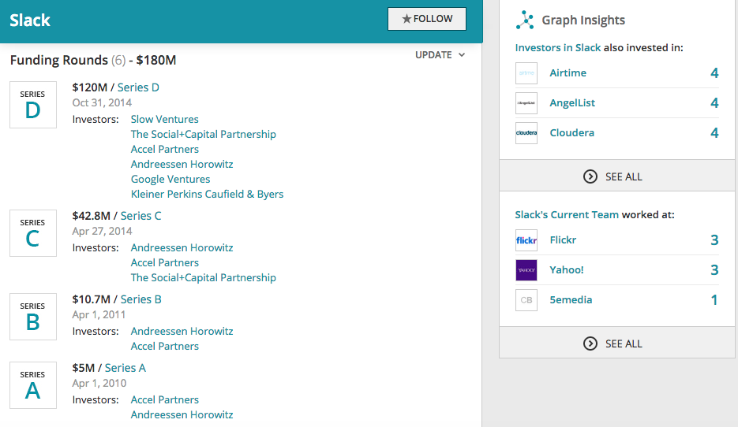

---

## 跟著大神就對了？！

 
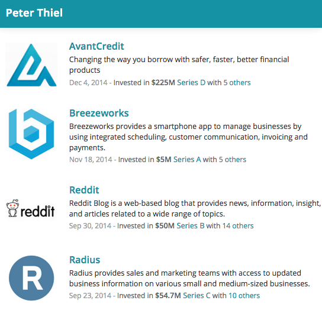 

---

## CrunchBase Ecosystem

* Venture Program
* Startup Calendar
* API Release & Data Exports
* Starpup Universe
  

---

## Who monetize the data?

   

---

## 問題：開放資料真的好用嗎？

* 經典案例：How can I supposed to track McDonald’s business status?
* 你聽過 `FCC license` 嗎？聯邦通信委員會？
* Drive-through 得來速
* 公開資料不代表資訊對等

 
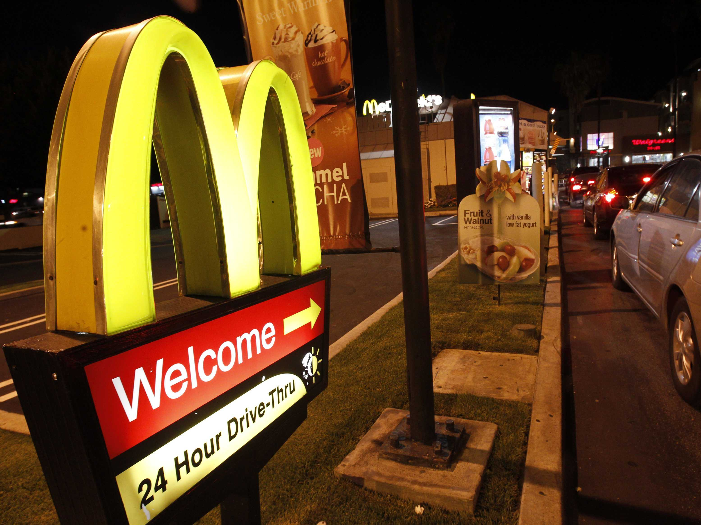

---

## Enigma.io 

* Funded 2011, $6.4 Million in 3 Rounds from 13 Investors, 10+ employee
* 美軍破解德軍潛艇的Enigma密碼而殲滅狼群，保護大西洋補給線
* 完整的開放資料集統整，單一搜尋窗口，一次瀏覽所有相關資料
* 整合多變資料格式，快速跨資料集搜尋
* 模式：API Licenses 數據服務費用，優惠學術機構非營利組織，最大客戶來自對沖基金

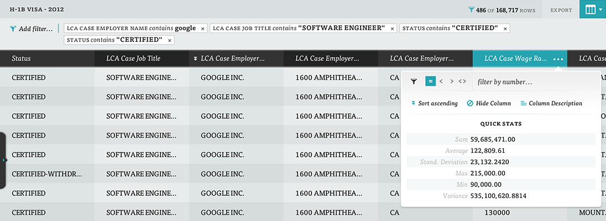

---

## Palantir Technologies 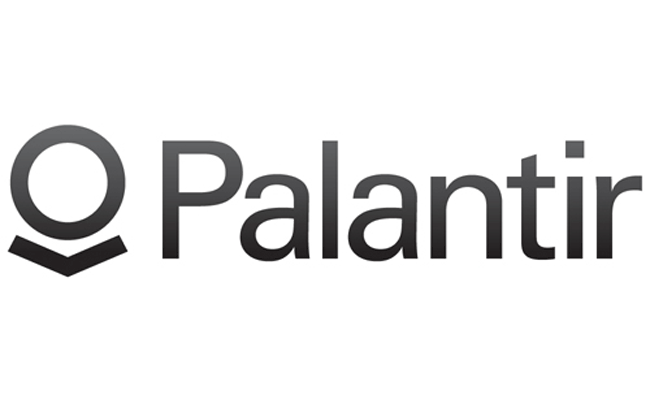

* Funded 2004, $950 Million in 14 Rounds from 10 Investors, 1,500 employee
* One of the most valuable private companies in tech
* CIA(2005-2008), 美國證券交易委員會, 美國情報體系
  * 打擊犯罪、防止詐騙、反恐、人口走私、商業調查
* Helping catch Osama bin Laden
* 轉型：農業、能源、氣候...
* 技術：強大可視化能力(VAST2009)，機器學習。Hadoop, Spark, Storm, GraphLab, Python, R, MATLAB...

---

## DueDil 

* DueDil -> Due Diligence   `自我評估、分析對手、供應鏈、客戶分析`
* Funded 2011, $22 Million in 5 Rounds from 7 Investors, 1,500 employee
$22 Million in 5 Rounds from 7 Investors
* 20 年的產業資料集，開放資料、專利性質資料、客戶主動提供。

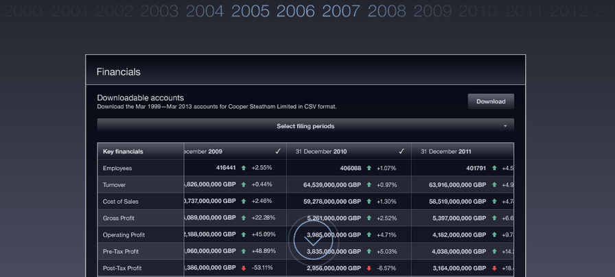

---

## DueDil - 目標中小企業客群

* 大大降低小型企業、創業族分析產業的成本
* 收費模式：從 24.99歐元 / month 到專業客製化分析服務

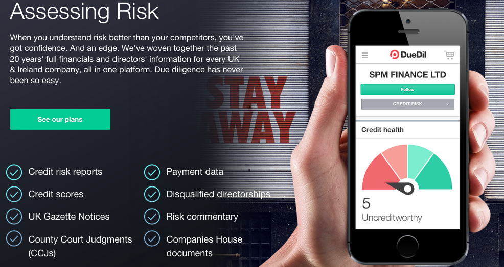

---

## DueDil - 風險控管、尋找潛在客戶

* 產業搜尋、關鍵字搜尋、地域搜尋
* 風險警示，幫助企業做決定！

---

## Trifacta, Tamr, Paxata

`Cuts down on big data dirty work` !!!

---

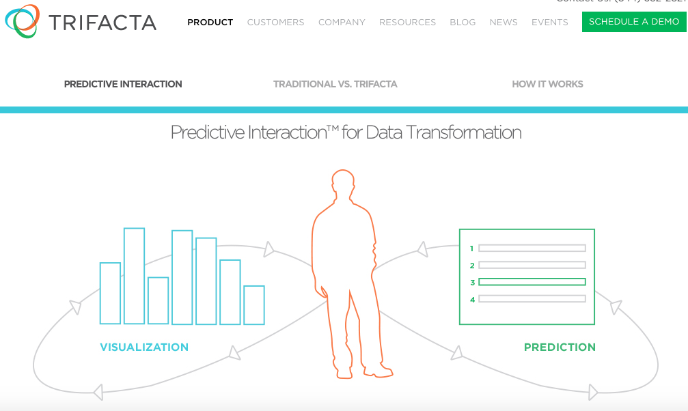

---

## Trifacta   一鍵式資料處理

* Funded 2012, $41.3 Million in 3 Rounds from 7 Investors, 50- employee
* From data transformation to data visulization
* Partner with cloudera, hortonwork, tableau, pivotal...

  

---

## Trifacta   Close the gap between people and data

* Auto transform and clean data into hadoop
* Stinger、Apache Drill、Impala、Spark
* Customer no need to learn PIG or Scala, or choose between Spark or MapReduce, just use DSL

 

---

## Tamr 與客戶平台共存

* Tamr use RESTful APIs to connect customer sources.

---

## PsychSignal

* Twitter, StockTwits and chat rooms
 

---

## 開放資料生態圈

`GetRaised`  使用81%的女性真正獲得加薪，平均獲得加薪為6473美元。

`Aidin`  語意分析病人對看病經驗的評價

`Locatable`  尋找室友

`Capital Cube`  金融資訊

`ZocDoc.com`  醫療界的 OpenTable，預約看診、填補門診空缺

  

# 有豐富的資料，就有加值的應用！

