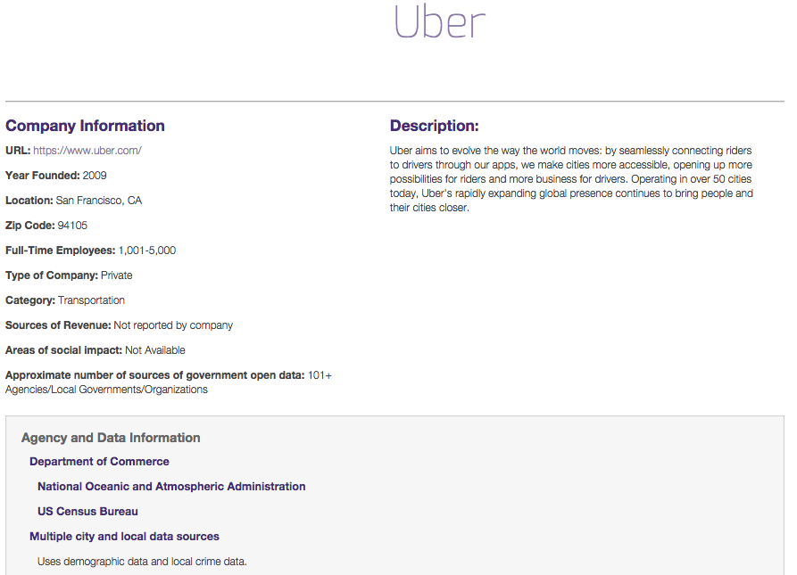
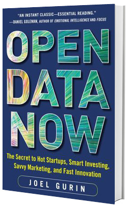
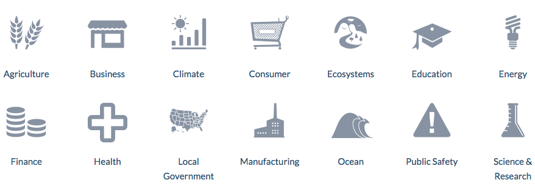
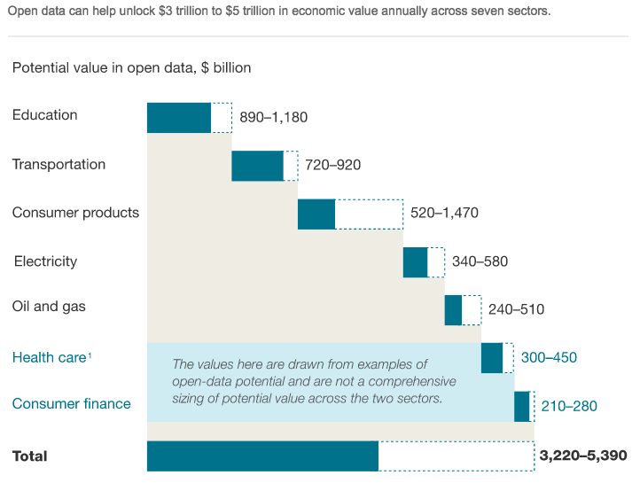
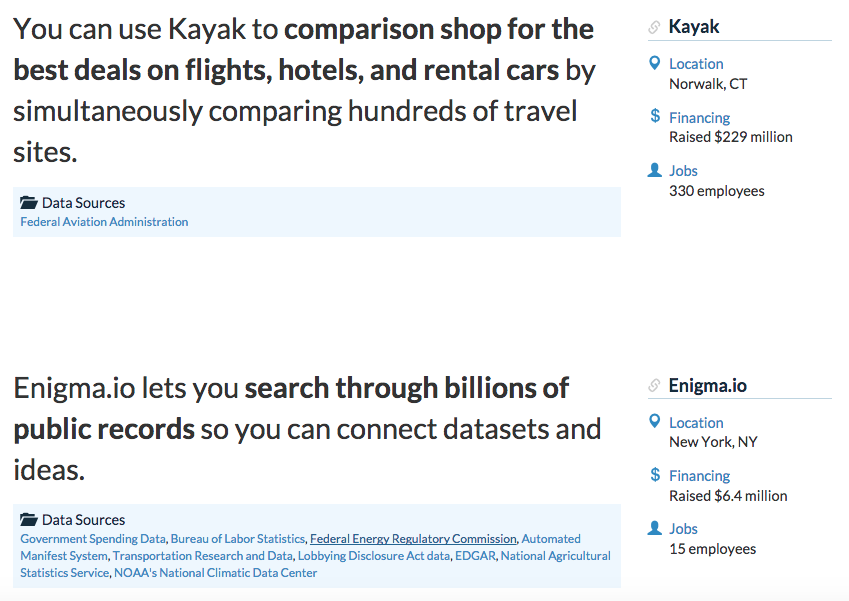
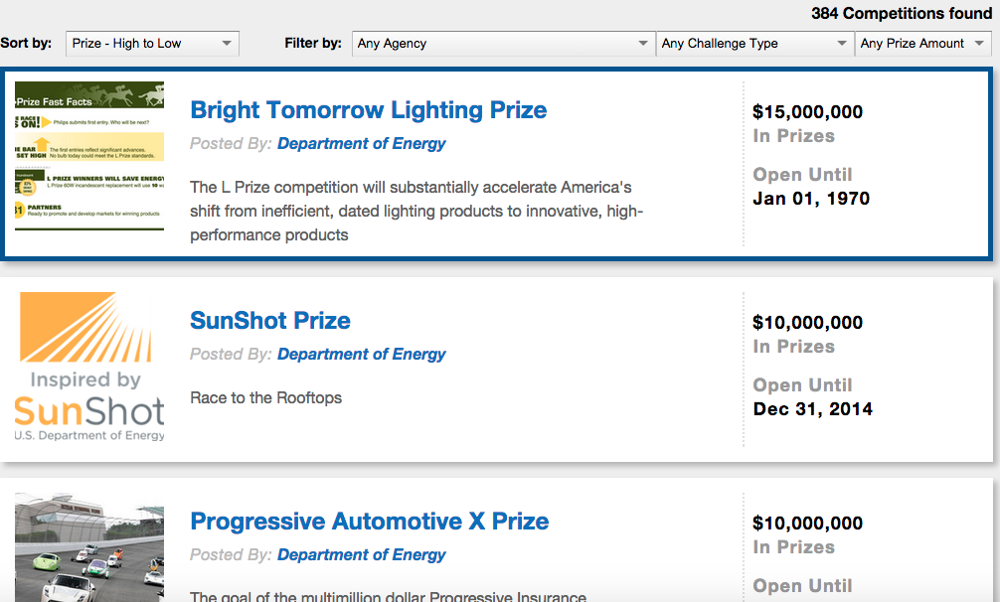

## Host 

Vivian Shangxuan Zhang!!

* Co-founder of SupStat Inc.

  * Founder, Lead Instructor of NYC Data Science Academy

* Founder, NYC Open Data Meetup

* Adjunct Professor at NYU and Stony Brook University  
   

   

---

<iframe src="http://www.opendata500.com/chart/" width="768" height="688" marginwidth="0" marginheight="0" scrolling="yes" frameborder="0"></iframe>

--- 

## Open Data 500 Companies Project 

 

---

---

## Filter as you like

---

## 大大降臨

* Joel Gurin
  * Author of Open Data Now
  * Senior Advisor at The GovLab

 
 

---

## 公開資料集

| Gov          | Are           | Are |
|:-------------:|:-------------:| -------------:|
| US Government Open Data      | NYC Open Data | Dun & Bradstreet |
| Federal Aviation Administration Data Research| CrunchBase      | U.S. News |
| Medicare.gov | OpenCorporates      | MyVisaJobs.com |
| CMS.gov      | | Socrata |
| UNdata | | CBOE |
| WHO data | | OANDA |
| US Census | | NASDAQ | 
| USGS | | |
| OECD | | |
| INFORUM EconData | | |
| THE WORLD BANK | | |

---

## US Government Open Data - Data.gov

* Over 137,601 datasets in the world in more than 20 catagory
* api, sample code, help to conduct research, build apps, design data visualizations, and more.
  * Catalog Validator, CSV-to-API, DB-to-API, PDF-Filler ... 

 

---

## 強調 `資料的產值`

---

## 當然不只是做研究

---

## 也不是辦徵文比賽   **Challenge.gov**

 

---

 

---

 

---

infofochimps
QlikView (DataMarket)
Junar
Buzzdata
