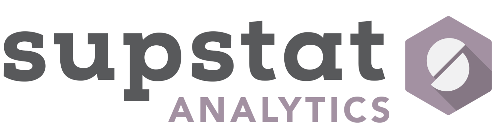

## Host 

Vivian Shangxuan Zhang!!

* Co-founder of SupStat Inc.

  * Founder, Lead Instructor of NYC Data Science Academy

* Founder, NYC Open Data Meetup

* Adjunct Professor at NYU and Stony Brook University  
   

   

---

<iframe src="http://www.opendata500.com/chart/" width="768" height="688" marginwidth="0" marginheight="0" scrolling="yes" frameborder="0"></iframe>

--- 

## Open Data 500 Companies Project 

 

---

---

## Filter as you like

---

## 大大降臨

* Joel Gurin
  * Author of Open Data Now
  * Senior Advisor at The GovLab

 
 

---

## 公開資料集

要反白的文字

| Tables        | Are           | Cool  |
| ------------- |:-------------:| -----:|
| col 3 is      | right-aligned | $1600 |
| col 2 is      | centered      |   $12 |
| zebra stripes | are neat      |    $1 | 
